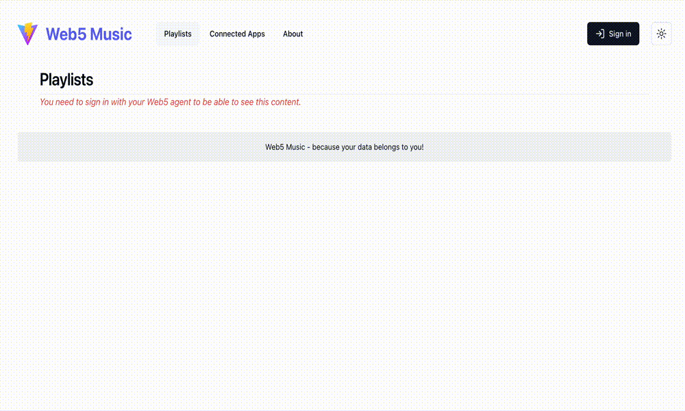

# Web5 Music

A fully decentralized music player for your life! Access now on: https://bucolic-cendol-324631.netlify.app/



The idea of the Web5 Music App is to allow you to connect to your favorite music apps and import playlists to your Decentralized Web Node (DWNs), so you take control of your data. The app will orchestrate the synchronization of these playlists and store the songs in the DWN.

In the above demo the user is executing this flow:

- Signin with the Browser In-App agent (`Web5.connect`)
- Allowing access to Spotify
- Importing the playlists from Spotify, **storing them on the DWN**
- (On the background the user adds a new song to the `popmix` playlist)
- Upon a refresh we can see that the `popmix` was not synchronized anymore (yellow warning button)
- Then the user synchronizes back to the Web5 DWN

Right now the app is only integrated with Spotify and a one-way synchronization to the from the App to the DWN. But by adding more apps such as Youtube, iTunes etc. and implementing the synchronization from the DWN to these connected apps, the user will:

1. Be truly in charge of their data; they can cancel their services and still own their playlists.
2. Solve the annoying problem of synchronizing their music playlists across different services. It's very common for people to have multiple services subscriptions to use in different devices (TV, Car Radio, Alexa), and it's very annoying to maintain their fav'songs in sync. The DWN being the hub and automatically synchronizing their data this problem is gone!
3. Be protected from services accounts ban and/or service shutting down.

## Local Development

Requirements:

- Clone this repo and run the commands from the root folder
- The whole development was done on node `v18.17.0` specified on the .nvmrc file (`nvm use`)
- You will need `pnpm` (`npm install -g pnpm`)

After ensuring the above requirements, run from the root folder:

```sh
pnpm install
pnpm dev
```

The app will be served on http://localhost:5180

To run the unit tests, simply execute:

```sh
pnpm test
```

### Spotify App

In order to connect to Spotify in your local environment, you need to create an app on Spotify [here](https://developer.spotify.com/).
Just create an App and set the redirect URIs to: `http://localhost:5180/connected-apps/spotify`

Then create your .env.local file (`cp .env .env.local`) and override the `VITE_SPOTIFY_CLIENT_ID` with yours.

## Build

```sh
pnpm lint
pnpm build
```

The `/dist` is a static generated HTML React app folder, just serve it anywhere, just make sure to:

- allow redirect `/*` to the `index.html`
- edit the `VITE_SPOTIFY_REDIRECT_URI`, it should be `https://deployed-domain.com/connected-apps/spotify`

## Project Directories Structure

```sh
├── index.html          # HTML Entry point
├── public              # Public static folder
└── src
    ├── components      # React UI Components
    │   ├── connectors  # - Connectors buttons and sync status components
    │   ├── layout      # - General layout components: page layout, header, footer etc.
    │   ├── misc        # - Miscellaneous components such as theme toggler
    │   ├── playlists   # - Playlists components and the music player
    │   ├── ui          # - UI core components (mostly powered by https://ui.shadcn.com/)
    │   └── web5        # - Web5 UI components: signin and signout buttons
    │
    ├── lib             # Core libs to support the frontend application and extra utils helpers such as timers.
    │   ├── connectors  # - Connectors core lib: Connectors providers and connected apps abstractions: SpotifyConnector, etc.
    │   └── web5        # - Web5 core lib resources: useWeb5, Web5PlaylistsStore and the React Context Provider
    │
    ├── pages           # Routed pages
    ├── assets          # Assets to be imported and built in the bundle such as SVG Icons
    │
    └── tests           # Test helper functions and fixtures
```

## Future Improvements

- [ ] Handle Spotify token refresh: at the moment we are shamelessly redirecting to the `/connected-apps` page when we detect a 401 (Unauthorized) response from the API.
- [ ] Figure out a better mocking mechanism for the Web5 object with vitest
- [ ] Develop a Playlist "Management" functionality where the user can search for songs and edit playlists inside the Web5 Music App and then import these playlists to the connected apps.
- [ ] Thumbnails are being referenced from Spotify, ideally we should persist in our DWN. And probably/possibly the audio files too!
- [ ] Implement a remote DWN that will be syncing automatically the user playlists from all the connected apps that the user allowed once.
- [ ] Add support to external DID agents/wallets.
- [ ] Add more unit tests 😝
- [ ] Implement more connected apps:
  - [ ] Tidal
  - [ ] Youtube Music
  - [ ] Amazon Music
  - [ ] Apple iTunes
  - [ ] Pandora
